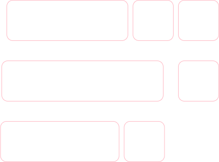
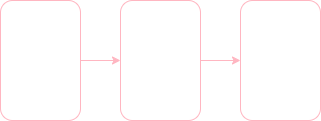

## Binary classification

**Plan for this modul:**
- Identify customers with a **high churn score**.
- Send **personalized emails** to those customers to encourage retention.
$$
\color{Pink} g(x_{i}) \approx y_{i} 
$$

$$
\color{Pink} \text{where } i \text{ is the customer number, and } y_{i} \in \{0, 1\}
$$

$$
\color{Pink} 
\text{Interpretation: }
\begin{cases}
y_{i} = 1 & \text{– churn, we send spam}, \\
y_{i} = 0 & \text{– no churn we don't have to do sth .}
\end{cases}
$$

## Data Preparation
`df.T`  - transpose the table (like a matrix)

## Setting Up The Validation Framework

`train_test_split` (from `sklearn.model_selection`)
- **Purpose:** Split a dataset into **training** and **testing** parts.
- **Why:** To train a model on one part of the data and **evaluate it on unseen data**.
- **Example usage:**
```
from sklearn.model_selection import train_test_split

X_train, X_test, y_train, y_test = train_test_split(
    X, y, test_size=0.2, random_state=42
)
```

- `X` = features, `y` - target
- `test_size=0.2` - 20% of data goes to testing
- `random_state=42` - makes the split **reproducible**

Split data with `train_test_split`



## EDA


`df.churn.value_counts(normalize=True)` - calculates the relative frequency (proportion) of each unique value

## Feature importance: Churn rate and risk ratio

1. Difference:
	`Difference = Global Churn Rate − Group Churn Rate`
    - If **Difference < 0** - **Group is more likely to churn**
    - If **Difference > 0** - **Group is less likely to churn**

2. Risk Ratio
$$
\color{Pink} \text{Risk ratio} = \frac{\text{group churn rate}}{\text{global churn rate}}
$$
		- If **Difference > 1** - **Group is more likely to churn**
		- If **Difference < 1** - **Group is less likely to churn**

`df.groupby()` — groups the data by categorical values, similar to `GROUP BY` in SQL
`from IPython.display import display` is used to **nicely display objects in Jupyter Notebook / IPython**

## Feature importance: Mutual information

`from sklearn.metrics import mutual_info_score` imports a function from **scikit-learn** that allows you to **measure the mutual information between two discrete variables**

`df.apply()` – applies a function to each row or column (Series), not to individual values.


`mi.sort_values(ascending=False)` – sorts the values from **highest to lowest**.

## Feature importance: Correlation

`df[numerical].corrwith(df.churn).abs()` – calculates the absolute Pearson correlation between each numerical feature and the churn column, showing how strongly each variable is related to churn (ignoring the direction of the correlation).

## One-hot encoding

`DictVectorizer()` converts a list of dictionaries (records) into a numeric matrix. 
Categorical features are one-hot encoded, numerical features remain as-is. 
Used to prepare data for ML models.
`fit_transform()` - learns the encoding or transformation rules from the training data and applies them immediately (used on training set)
`transform()` - applies the learned rules from the training data to new data (validation/test), without changing the rules

## Logistic regression
 $$\color{Pink} \large g\left(x_{i}\right) = y_{i}$$

$$\color{Pink} \large g\left(x_{i}\right) = Sigmoid\left(w_{0} + w_{1}x_{1} + w_{2}x_{2} + ... + w_{n}x_{n}\right)$$

**Sigmoid**
- **What it does:** Turns any number into a value between 0 and 1
- **Why it’s useful:** Makes numbers behave like **probabilities**
- **Shape:** S-curve – small numbers → close to 0, big numbers → close to 1
- **Formula:**
$$\color{Pink} \large Sigmoid\left(z\right)=\frac{1}{1 + exp\left( -z \right)}$$

##  Training logistic regression with Scikit-Learn
`LogisticRegression()` – uses the sigmoid function to convert outputs into probabilities  
`intercept_[0]` – bias term (w₀)  
`coef_[0]` – weights (w₁, w₂, …)  
`predict_proba()` – soft prediction → returns class probabilities  
`predict()` – hard prediction → returns the final class (0 or 1)

## Model interpretation
`zip(x, y)` – pairs elements from two lists together (element 1 from x with element 1 from y, etc.)
